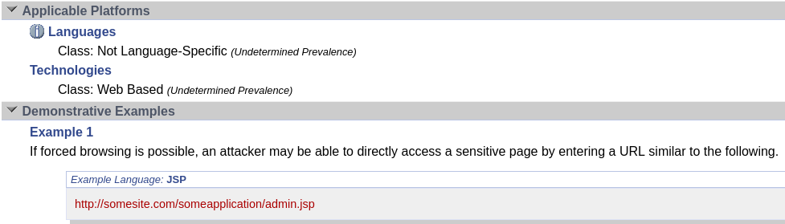
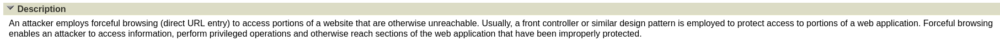

# Trazado de una vulnerabilidad

Actividad perteneciente a https://github.com/jmmedinac03vjp/PPS-Unidad2Actividad1-JoseMi

Indice de contenidos:

1. [Información sobre la vulnerabilidad](#información-sobre-la-vulnerabilidad)
2. [Información sobre las debilidades explotadas](#información-sobre-el-riesgo-o-criticidad-de-una-vulnerabilidad)
3. [Información sobre las debilidades explotadas](#información-sobre-las-debilidades-explotadas)
4. [Información sobre patrones de ataque](#información-sobre-patrones-de-ataque)
5. [Descarga del Registro CVE de la vulnerabilidad](#descarga-del-registro-cve-de-la-vulnerabilidad)

- - -

Vulnerabilidad a trazar [GoAnywhere MFT de Fortra](https://www.incibe.es/empresas/avisos/vulnerabilidad-critica-de-omision-de-autenticacion-en-goanywhere-mft-de-fortra).

## Información sobre la vulnerabilidad

En la web de incibe donde alerta sobre la vulnerabilidad al final del artículo podemos enoctrar el cve de la vulnerabilidad.

Y un poco más abajo se encuentra el enlace al comunicado propio de la empresa del software que sufre la vulnerabilidad [FI-2024-001 - Authentication Bypass in GoAnywhere MFT](https://www.fortra.com/security/advisories/product-security/fi-2024-001).

En el comunicado de la empresa nos detalla tambien el cve al que hace referencia, información de la criticidad, etc.

Si nos fijamos en el apartado de "nostas de la vulnerabilidad" nos informa de que la vulnerabilidad se encuentra parcheada a partir de la versión 7.4.1 o superior.

## Información sobre el riesgo o criticidad de una vulnerabilidad

Encontramos información más detallada tanto en la web [CVE referente a la vulnerabilidad CVE-2024-0204](https://www.cve.org/CVERecord?id=CVE-2024-0204) como en la gubernamental [NIST refente a la vulneabilidad CVE-2024-0204](https://nvd.nist.gov/vuln/detail/CVE-2024-0204). Podemos observar que nos da una descripción de la vulnerabilidad seguido de la puntuación que define su gravedad para la versión 3 del estandard métrico.

Si ponemos el cursor sobre el Vector nos aparecerán los valores correspondientes a las diferentes métricas que se han usado para el calculo de la puntuación.

Podemos observar información como la puntuación base de criticidad es 9.8 dado de la suma de los valores 5.9 de impacto y 3.9 de la posibilidad de explotación:
- El vector de ataque se produce desde la red.
- La complejidad de ataque es baja.
- No emplea ningún privilegio en el sistema para explotar la vulnerabilidad.
- No requiere una interacción por parte del usuario.
- El alcance no se modifica (es decir, que no podemos acceder o cambiar a otro sistema con controles de seguridad diferente).
- Impacto en Confidencialidad: alto.
- Impacto en Integridad: alto.
- Impacto en Disponibilidad: alto.

## Información sobre las debilidades explotadas
Otra información adicional que nos ofrece el NIST es el enlace a la debilidad.

El [enlace de Common Weaknes Enumeration](https://cwe.mitre.org/data/definitions/425.html) nos ofrece informatión detallada de la debilidad **CWE-425**, informandonos que consiste en que hay ciertas rutas que no están correctamente securizadas, debido a que asume que solo son accesibles desde otras que si están securizadas, permitiendo la explotación de CSRF o XSS.

Podemos observar que la vulnerabilidad no es específica de un solo lenguage, pero nos ofrecen como ejemplo una web de administración realizada con JSP una tecnología perteneciente a Java para el desarrollo web.

También encontramos referencias a otros ejemplos pertenecientes a vulnerabilidades similares.

## Información sobre patrones de ataque

[CWE](https://cwe.mitre.org/index.html) ofrece los enlaces a los patrones de ataque cuya información la podemos encontrar en la web de [CAPEC](https://capec.mitre.org/index.html).

- [CAPEC-127](https://capec.mitre.org/data/definitions/127.html)

- [CAPEC-143](https://capec.mitre.org/data/definitions/143.html)

- [CAPEC-144](https://capec.mitre.org/data/definitions/144.html)

- [CAPEC-668](https://capec.mitre.org/data/definitions/668.html)

- [CAPEC-87](https://capec.mitre.org/data/definitions/87.html)

En cada uno de los patrones de ataque destacan las siguientes secciones:

- **Descripción**: nos ofrece información básica sobre como funciona el ataque.

- **Relaciones**: indica si es hijo o pade de otro patrón de ataque.

- **Flujo de ejecución**: nos da información detallada de como se produce el ataque.

- **Requisitos previos**: indica que requisitos se deben cumplir para poder realizar el ataque.

- **Mitigaciones**: pautas para evitar la explotación del ataque.

- **Vulnerabilidades asociadas **: muestra una lista de vulnerabilidades que sufren este patrón de ataque.

## Descarga del Registro CVE de la vulnerabilidad

Si accedemos a la web [CVE referente a la vulnerabilidad CVE-2024-0204](https://www.cve.org/CVERecord?id=CVE-2024-0204) podemos observar que en la parte superior tenemos enlace a los datos de la vulnerabilidad en formato Json.

Al acceder al enlace del fichero Json podemos ver todos los datos referentes a la vulnerabilidad, descargarlo o pasar el enlace a alguna herramienta software que nos muestre la información deseada.

